# Arquitetura e Fluxos da Aplicação

Este documento descreve os fluxos de execução e a arquitetura detalhada da aplicação NestJS.

## Fluxo Principal da Aplicação

### 1. Fluxo de Inicialização (Startup Flow)

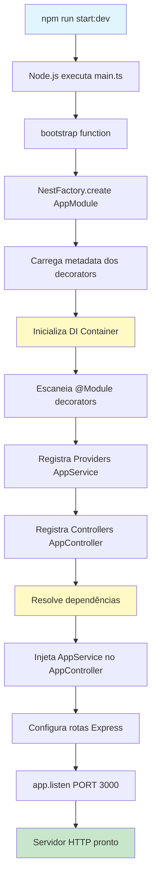

### 2. Fluxo de Requisição HTTP (Request Flow)

```mermaid
graph LR
    A[Cliente HTTP] -->|GET /| B[Express Server]
    B --> C{Router}
    C -->|match route| D[AppController]
    D --> E[@Get handler]
    E --> F[Chama AppService]
    F --> G[getHello method]
    G --> H[Business Logic]
    H --> I[Retorna 'Hello World!']
    I --> E
    E --> D
    D --> B
    B --> A

    style A fill:#e1f5ff
    style B fill:#fff9c4
    style D fill:#ffe0b2
    style F fill:#c8e6c9
    style H fill:#f8bbd0
```

### 3. Fluxo de Injeção de Dependências

```mermaid
graph TD
    A[Application Bootstrap] --> B[DI Container Initialize]
    B --> C{Scan Modules}
    C --> D[AppModule]
    D --> E{Parse Metadata}
    E -->|providers| F[AppService]
    E -->|controllers| G[AppController]

    F --> H[@Injectable decorator]
    H --> I[Register in Container]
    I --> J[Create Instance]

    G --> K[@Controller decorator]
    K --> L[Check Dependencies]
    L -->|needs AppService| M{Resolve from Container}
    M -->|found| N[Inject via Constructor]
    N --> O[AppController Instance Ready]

    J -.->|available for injection| M

    style B fill:#fff9c4
    style I fill:#c8e6c9
    style M fill:#ffe0b2
    style O fill:#c8e6c9
```

## Fluxo Detalhado por Componente

### main.ts - Entry Point

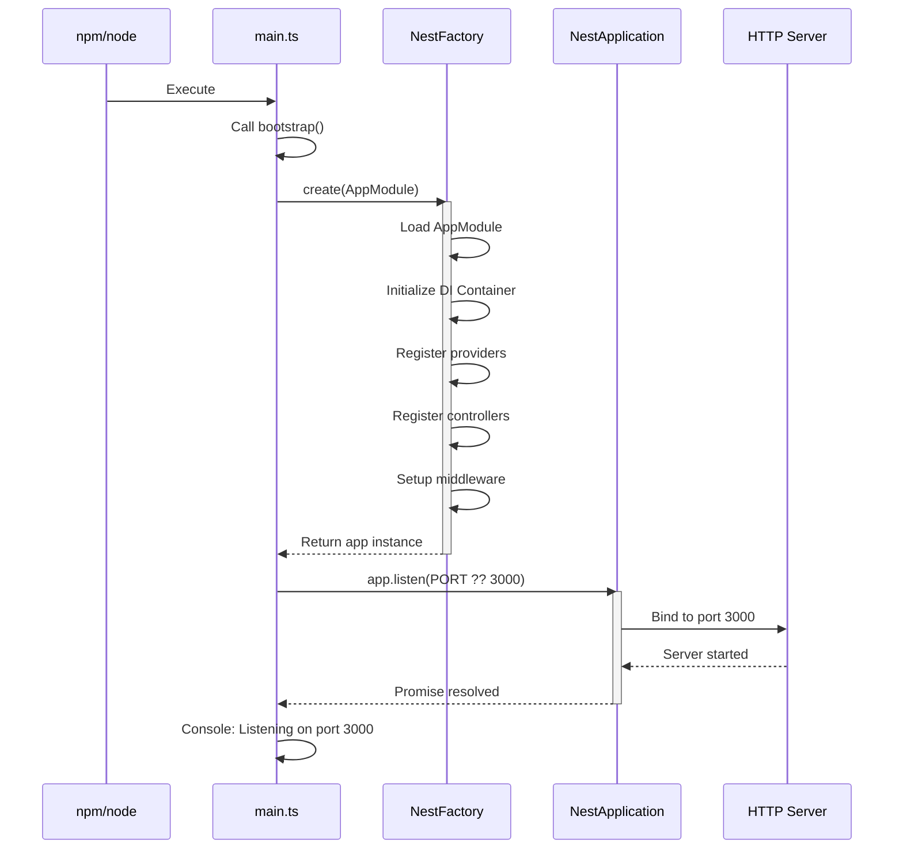

### AppModule - Dependency Container

```mermaid
graph TD
    A[@Module Decorator] --> B[Metadata Registration]
    B --> C{Module Properties}

    C -->|imports| D[External Modules]
    C -->|controllers| E[AppController]
    C -->|providers| F[AppService]
    C -->|exports| G[Exported Providers]

    D --> H[Future: UsersModule<br/>CoursesModule, etc]

    E --> I[HTTP Route Handlers]
    I --> J[Request/Response Logic]

    F --> K[Business Logic]
    K --> L[Injectable Services]

    G --> M[Shared with other modules]

    style A fill:#e1f5ff
    style C fill:#fff9c4
    style E fill:#ffe0b2
    style F fill:#c8e6c9
```

### AppController - HTTP Layer

```mermaid
graph TD
    A[@Controller Decorator] --> B[Define base route: '/']
    B --> C[Constructor Injection]
    C --> D[Receive AppService]

    D --> E[@Get Decorator]
    E --> F[Define GET / route]
    F --> G[getHello method]

    G --> H[Call this.appService.getHello]
    H --> I[Return response]

    I --> J{Response Type}
    J -->|string| K[Return as text/html]
    J -->|object| L[Serialize to JSON]
    J -->|custom| M[Use Interceptors/Pipes]

    style A fill:#ffe0b2
    style C fill:#fff9c4
    style E fill:#e1f5ff
    style H fill:#c8e6c9
```

### AppService - Business Logic Layer

```mermaid
graph TD
    A[@Injectable Decorator] --> B[Mark as Provider]
    B --> C[Available for DI]

    C --> D[getHello Method]
    D --> E{Business Logic}

    E --> F[Process Data]
    E --> G[Call External APIs]
    E --> H[Database Operations]
    E --> I[Transform Data]

    F --> J[Return Results]
    G --> J
    H --> J
    I --> J

    J --> K[To Controller]

    style A fill:#c8e6c9
    style B fill:#fff9c4
    style E fill:#f8bbd0
```

## Fluxo de Testes

### Unit Tests Flow

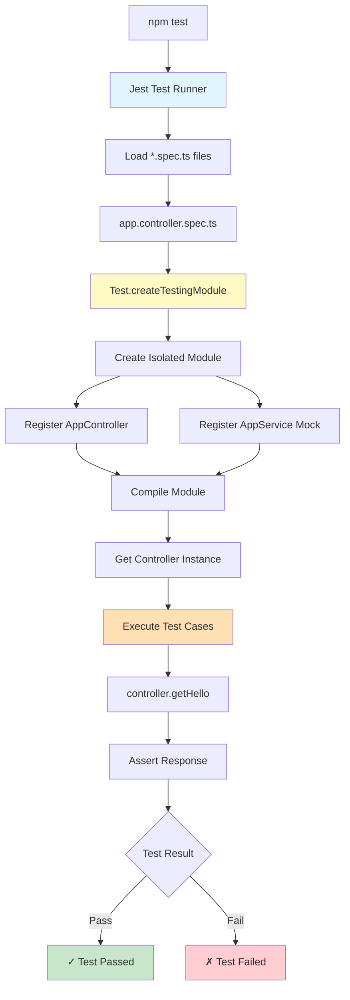

### E2E Tests Flow

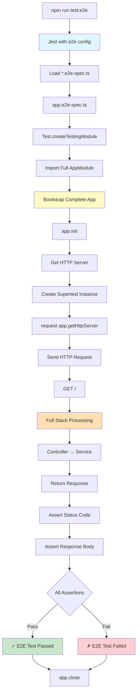

## Fluxo de Build e Deploy

### Build Process

```mermaid
graph LR
    A[npm run build] --> B[NestJS CLI]
    B --> C[Read nest-cli.json]
    C --> D[Read tsconfig.json]
    D --> E[TypeScript Compiler]

    E --> F[Compile src/**/*.ts]
    F --> G[Generate dist/**/*.js]
    G --> H[Generate dist/**/*.d.ts]
    H --> I[Generate source maps]

    I --> J[Delete old dist/]
    J --> K[Copy assets if any]
    K --> L[Build Complete]

    style A fill:#e1f5ff
    style E fill:#fff9c4
    style L fill:#c8e6c9
```

### Production Deployment Flow

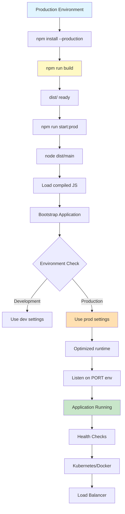

## Fluxo de Expansão com Novos Módulos

### Adding Feature Module Flow

```mermaid
graph TD
    A[nest g module users] --> B[Create users.module.ts]
    B --> C[nest g controller users]
    C --> D[Create users.controller.ts]
    D --> E[nest g service users]
    E --> F[Create users.service.ts]

    F --> G[Update users.module.ts]
    G --> H[Register Controller and Service]

    H --> I{Import in AppModule}
    I --> J[Add to imports array]
    J --> K[Module Available]

    K --> L[Define Routes]
    L --> M[@Get, @Post, @Put, @Delete]

    M --> N[Implement Service Methods]
    N --> O[Add DTOs for validation]
    O --> P[Create Entities if needed]

    P --> Q[Write Unit Tests]
    Q --> R[Write E2E Tests]
    R --> S[Feature Complete]

    style A fill:#e1f5ff
    style G fill:#fff9c4
    style K fill:#c8e6c9
    style S fill:#c8e6c9
```

## Fluxo de Requisição Completo (Detalhado)

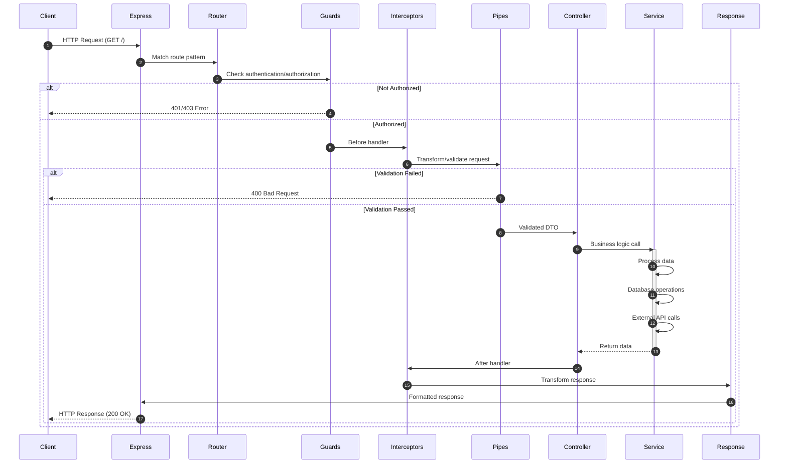

## Estrutura de Módulos Futura

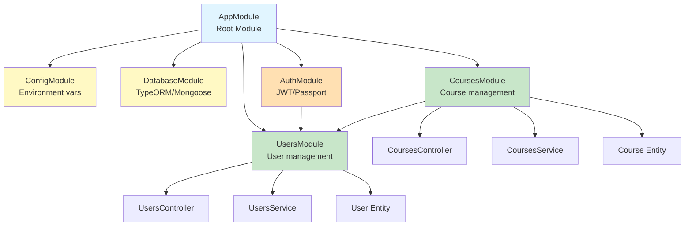

## Fluxo de Dados (Data Flow)

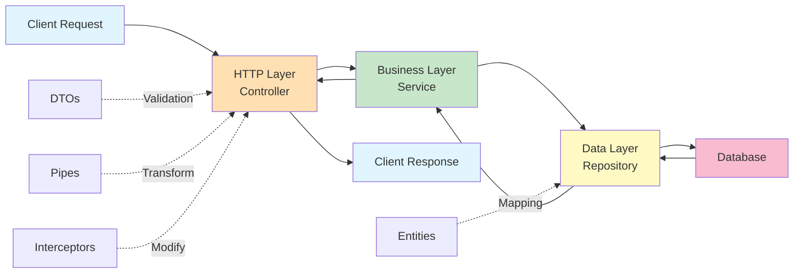

## Middleware e Guards Flow

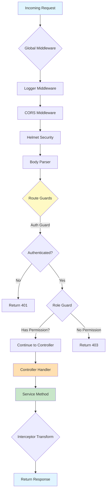

## Performance e Escalabilidade

### Horizontal Scaling

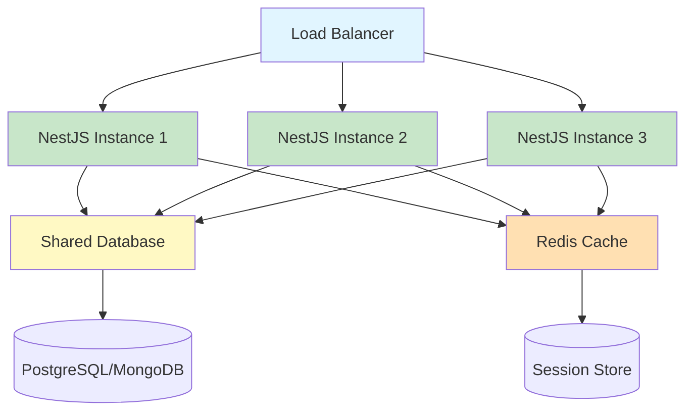

## Observabilidade

```mermaid
graph LR
    A[NestJS App] --> B[Logger Service]
    A --> C[Health Endpoint]
    A --> D[Metrics]

    B --> E[Winston/Pino]
    E --> F[Log Aggregator]

    C --> G[/health endpoint]
    G --> H[Kubernetes Probes]

    D --> I[Prometheus Metrics]
    I --> J[Grafana Dashboard]

    style A fill:#c8e6c9
    style E fill:#fff9c4
    style G fill:#ffe0b2
    style I fill:#e1f5ff
```
