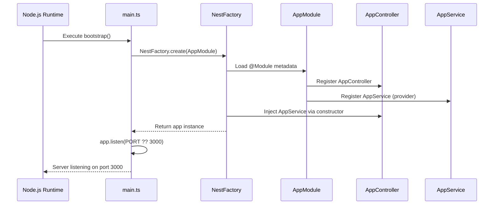
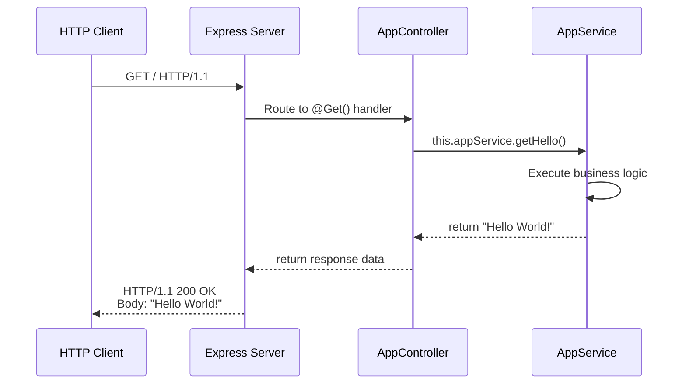
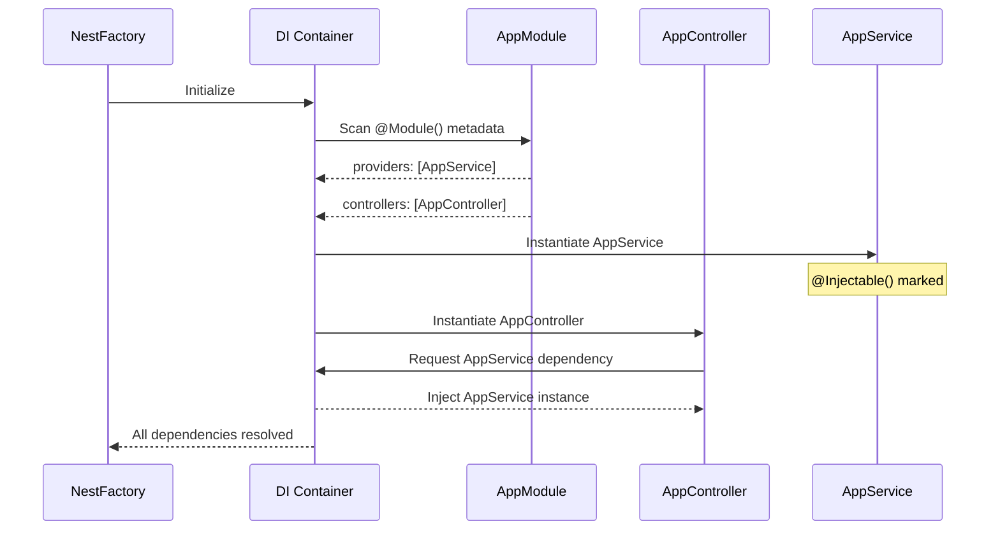
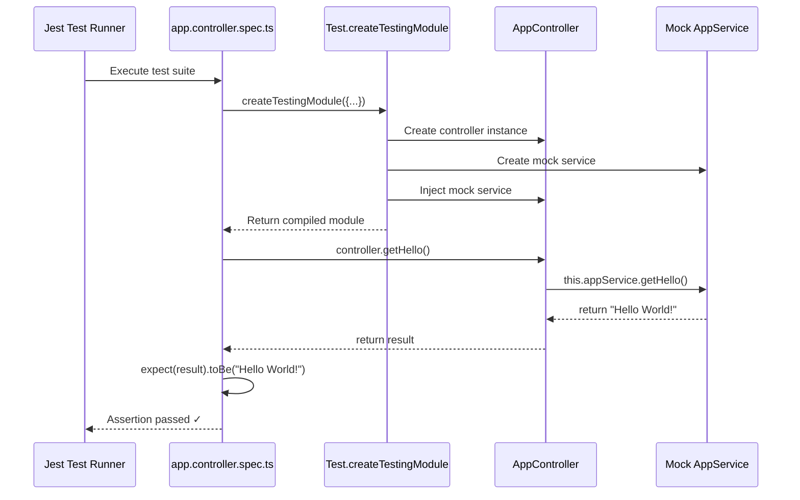
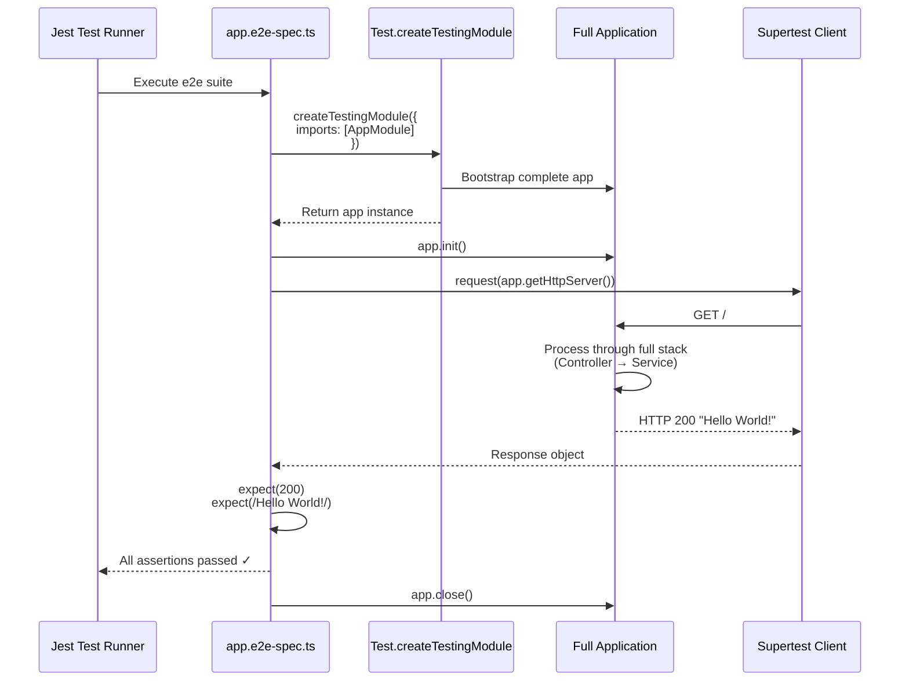

# CLAUDE.md

This file provides guidance to Claude Code (claude.ai/code) when working with code in this repository.

## Project Overview

This is a NestJS TypeScript API project (course-api-ia) with a **complete Products CRUD API** implemented. The project follows standard NestJS architectural patterns with modular design, validation, and comprehensive test coverage.

### Implemented Features

✅ **Products Module** - Complete CRUD API for product management
- RESTful endpoints (POST, GET, PATCH, DELETE)
- In-memory storage (array-based)
- Pagination with customizable page size
- Soft delete pattern (isActive flag)
- Automatic validation with class-validator
- UUID v4 for product IDs
- Automatic timestamp management
- 100% test coverage (60 tests: 24 service + 14 controller + 22 e2e)

## Essential Commands

### Development
```bash
npm run start:dev    # Start dev server with hot reload
npm run start:debug  # Start with debug inspector enabled
npm run start        # Start without watch mode
npm run start:prod   # Run compiled production build
```

### Build
```bash
npm run build        # Compile TypeScript to dist/
```

### Testing
```bash
npm test             # Run unit tests
npm run test:watch   # Run tests in watch mode
npm run test:cov     # Run tests with coverage report
npm run test:e2e     # Run end-to-end tests
npm run test:debug   # Run tests with debugger attached
```

### Code Quality
```bash
npm run lint         # Run ESLint with auto-fix
npm run format       # Format code with Prettier
```

## Architecture Overview

### NestJS Module Pattern

The application follows NestJS's modular architecture with dependency injection:

- **Entry Point** ([src/main.ts](src/main.ts)): Bootstraps the application using `NestFactory.create(AppModule)`, listens on port 3000 (or `PORT` env var)
- **Root Module** ([src/app.module.ts](src/app.module.ts)): Declares controllers, providers, and imports using `@Module()` decorator
- **Controllers** ([src/app.controller.ts](src/app.controller.ts)): Handle HTTP requests/responses using route decorators (`@Get()`, `@Post()`, etc.)
- **Services** ([src/app.service.ts](src/app.service.ts)): Contain business logic, marked with `@Injectable()` for DI

### Dependency Injection Flow

```
main.ts → AppModule → AppController → AppService
```

## Sequence Diagrams

### Application Startup Sequence



### HTTP Request/Response Flow



### Dependency Injection Container Flow



### Unit Test Execution Flow



### E2E Test Execution Flow



## Project Structure

### Current Structure
```
src/
├── main.ts                      # Application entry point (with ValidationPipe)
├── app.module.ts                # Root module (imports ProductsModule)
├── app.controller.ts            # Root controller (GET / endpoint)
├── app.service.ts               # Root service
├── app.controller.spec.ts       # Unit tests
├── common/                      # Shared utilities
│   └── dto/
│       ├── pagination-query.dto.ts      # Reusable pagination DTO
│       └── paginated-response.dto.ts    # Generic paginated response
└── products/                    # Products feature module
    ├── products.module.ts       # Products module
    ├── products.controller.ts   # Products REST controller (5 endpoints)
    ├── products.service.ts      # Products business logic (in-memory)
    ├── products.controller.spec.ts  # Controller unit tests (14 tests)
    ├── products.service.spec.ts     # Service unit tests (24 tests)
    ├── dto/
    │   ├── create-product.dto.ts    # DTO for creating products
    │   └── update-product.dto.ts    # DTO for updating products
    └── entities/
        └── product.entity.ts        # Product interface

test/
├── app.e2e-spec.ts          # E2E tests for app
├── products.e2e-spec.ts     # E2E tests for products API (22 tests)
└── jest-e2e.json            # E2E Jest configuration

docs/
└── products-api-examples.md # Detailed API usage examples
```

### Recommended Structure for Feature Expansion
```
src/
├── main.ts
├── app.module.ts
├── users/                    # Feature module example
│   ├── users.module.ts
│   ├── users.controller.ts
│   ├── users.service.ts
│   ├── users.controller.spec.ts
│   ├── dto/
│   │   ├── create-user.dto.ts
│   │   └── update-user.dto.ts
│   └── entities/
│       └── user.entity.ts
├── courses/                  # Feature module example
│   ├── courses.module.ts
│   ├── courses.controller.ts
│   ├── courses.service.ts
│   └── dto/
└── common/                   # Shared utilities
    ├── filters/              # Exception filters
    ├── guards/               # Auth guards
    ├── interceptors/         # Request/response interceptors
    ├── pipes/                # Validation pipes
    └── decorators/           # Custom decorators
```

## Products Module (Implemented)

### Overview

The Products module provides a complete CRUD API for product management. It demonstrates best practices for NestJS modules including validation, error handling, pagination, and testing.

### Architecture

```
ProductsModule
├── ProductsController (HTTP layer)
│   └── Endpoints: POST, GET, GET/:id, PATCH, DELETE
├── ProductsService (Business logic)
│   └── In-memory storage (private array)
└── DTOs (Validation layer)
    ├── CreateProductDto
    ├── UpdateProductDto
    ├── PaginationQueryDto
    └── PaginatedResponseDto
```

### Key Implementation Details

#### 1. **In-Memory Storage**
- Products stored in private array: `private products: Product[] = []`
- Data is lost on server restart (suitable for dev/testing)
- No database dependencies required
- Fast and simple for prototyping

#### 2. **Soft Delete Pattern**
- Deleted products marked with `isActive: false`
- Products remain in system for historical data
- Inactive products excluded from listings
- Cannot be retrieved, updated, or deleted again

#### 3. **UUID Generation**
- Uses Node's crypto.randomUUID() for unique IDs
- Format: UUID v4 (e.g., "550e8400-e29b-41d4-a716-446655440000")
- Prevents ID enumeration attacks

#### 4. **Automatic Timestamps**
- `createdAt`: Set on product creation
- `updatedAt`: Updated on every modification
- Managed automatically by service

#### 5. **Pagination**
- Query params: `page` (default: 1), `limit` (default: 10, max: 100)
- Implementation: `Array.slice()` with calculated offset
- Returns metadata: total, page, limit, totalPages
- Only active products counted in total

#### 6. **Validation**
- Global ValidationPipe in [src/main.ts](src/main.ts:37-43)
- Options: whitelist, forbidNonWhitelisted, transform
- Class-validator decorators in DTOs
- Automatic type transformation (query string → number)

### API Endpoints

#### POST /products
Creates a new product.
```typescript
// Request
{
  "name": "Laptop Dell",
  "description": "Professional laptop",
  "price": 4500.00,
  "stock": 10
}

// Response (201)
{
  "id": "uuid",
  "name": "Laptop Dell",
  ...
  "isActive": true,
  "createdAt": "2024-01-28T10:00:00.000Z"
}
```

#### GET /products?page=1&limit=10
Lists products with pagination.
```typescript
// Response (200)
{
  "data": [...],
  "meta": {
    "total": 45,
    "page": 1,
    "limit": 10,
    "totalPages": 5
  }
}
```

#### GET /products/:id
Gets a single product by ID.
```typescript
// Response (200) or 404
```

#### PATCH /products/:id
Updates a product (partial update).
```typescript
// Request
{ "price": 4200.00 }

// Response (200) or 404
```

#### DELETE /products/:id
Soft deletes a product.
```typescript
// Response (200) - product with isActive: false
// or 404 if not found
```

### File References

- **Controller**: [src/products/products.controller.ts](src/products/products.controller.ts) - All REST endpoints
- **Service**: [src/products/products.service.ts](src/products/products.service.ts) - Business logic and storage
- **Entity**: [src/products/entities/product.entity.ts](src/products/entities/product.entity.ts) - Product interface
- **DTOs**: [src/products/dto/](src/products/dto/) - Validation objects
- **Tests**:
  - [src/products/products.service.spec.ts](src/products/products.service.spec.ts) - 24 service tests
  - [src/products/products.controller.spec.ts](src/products/products.controller.spec.ts) - 14 controller tests
  - [test/products.e2e-spec.ts](test/products.e2e-spec.ts) - 22 E2E tests
- **Examples**: [docs/products-api-examples.md](docs/products-api-examples.md) - Detailed usage examples

### Test Coverage

```bash
npm run test:cov
```

**Results:**
- Products Service: 100% coverage
- Products Controller: 100% coverage
- Products DTOs: 100% coverage
- Total: 60 tests passing (39 unit + 21 e2e)

### Common Patterns Used

1. **Dependency Injection**: Controller injects Service via constructor
2. **DTO Pattern**: Separate DTOs for create/update operations
3. **Partial Updates**: UpdateProductDto extends PartialType(CreateProductDto)
4. **Error Handling**: NotFoundException for missing resources
5. **Generic Types**: PaginatedResponseDto<T> for reusable pagination
6. **Validation Decorators**: @IsString(), @IsPositive(), @Min(), @Max()
7. **Type Imports**: `import type` for interfaces in decorators

### Migration Path to Database

To migrate from in-memory to database:

1. Install TypeORM: `npm install @nestjs/typeorm typeorm pg`
2. Add @Entity() decorator to Product interface
3. Add @Column() decorators to fields
4. Replace array operations with repository methods
5. Inject repository in ProductsService
6. Update service methods to use repository API

Example:
```typescript
// Before (in-memory)
this.products.find(p => p.id === id)

// After (TypeORM)
await this.productRepository.findOne({ where: { id } })
```

## Adding New Features

When adding new features, follow NestJS conventions and the patterns established in ProductsModule:

### 1. Generate Module Structure
```bash
nest generate module users
nest generate controller users
nest generate service users
```

### 2. Create DTOs for Validation
```typescript
// users/dto/create-user.dto.ts
export class CreateUserDto {
  name: string;
  email: string;
}
```

### 3. Update Module
```typescript
// users/users.module.ts
@Module({
  controllers: [UsersController],
  providers: [UsersService],
  exports: [UsersService],  // Export if used by other modules
})
export class UsersModule {}
```

### 4. Import in AppModule
```typescript
// app.module.ts
@Module({
  imports: [UsersModule],  // Add new module here
  controllers: [AppController],
  providers: [AppService],
})
export class AppModule {}
```

### 5. Implement Controller
```typescript
// users/users.controller.ts
@Controller('users')
export class UsersController {
  constructor(private readonly usersService: UsersService) {}

  @Get()
  findAll() {
    return this.usersService.findAll();
  }

  @Post()
  create(@Body() createUserDto: CreateUserDto) {
    return this.usersService.create(createUserDto);
  }
}
```

### 6. Implement Service
```typescript
// users/users.service.ts
@Injectable()
export class UsersService {
  findAll() {
    // Business logic here
  }

  create(createUserDto: CreateUserDto) {
    // Business logic here
  }
}
```

## TypeScript Configuration

- **Target**: ES2023 with modern JavaScript features
- **Module System**: nodenext (native ESM support)
- **Decorators**: Enabled (required for NestJS `@Injectable()`, `@Controller()`, etc.)
- **Strict Mode**: strictNullChecks enabled, noImplicitAny disabled for flexibility
- **Output**: `./dist` directory

## Testing Strategy

### Unit Tests
- Use `Test.createTestingModule()` to create isolated testing modules
- Mock dependencies using Jest
- Test files: `*.spec.ts`

```typescript
describe('AppController', () => {
  let appController: AppController;

  beforeEach(async () => {
    const app: TestingModule = await Test.createTestingModule({
      controllers: [AppController],
      providers: [AppService],
    }).compile();

    appController = app.get<AppController>(AppController);
  });

  it('should return "Hello World!"', () => {
    expect(appController.getHello()).toBe('Hello World!');
  });
});
```

### E2E Tests
- Bootstrap full application
- Test HTTP endpoints with supertest
- Test files: `*.e2e-spec.ts`

```typescript
describe('AppController (e2e)', () => {
  let app: INestApplication;

  beforeEach(async () => {
    const moduleFixture: TestingModule = await Test.createTestingModule({
      imports: [AppModule],
    }).compile();

    app = moduleFixture.createNestApplication();
    await app.init();
  });

  it('/ (GET)', () => {
    return request(app.getHttpServer())
      .get('/')
      .expect(200)
      .expect('Hello World!');
  });
});
```

## Common Development Patterns

### Controllers
- Keep controllers thin - delegate business logic to services
- Use DTOs for request/response validation
- Use proper HTTP status codes and decorators

### Services
- Contain business logic and data access
- Should be framework-agnostic when possible
- Use dependency injection for dependencies

### Modules
- Organize by feature (users, courses, etc.)
- Export providers that other modules need
- Keep modules focused and cohesive

## CI/CD

The project includes GitHub Actions workflows:
- **Claude Code Review**: Automated PR reviews
- **Claude PR Assistant**: @claude mention support in PRs

## Technology Stack

- **Framework**: NestJS v11.0.1
- **HTTP Adapter**: Express
- **Runtime**: Node.js (ES2023 target)
- **Language**: TypeScript 5.7.3
- **Validation**: class-validator + class-transformer + @nestjs/mapped-types
- **Testing**: Jest 30.0.0 with ts-jest + supertest (E2E)
- **Code Quality**: ESLint 9.18.0 + Prettier 3.4.2
- **Port**: 3000 (configurable via `PORT` env var)

## Environment Configuration

Currently uses environment variables:
- `PORT`: Server port (default: 3000)

For more complex configuration, consider adding `@nestjs/config`:
```bash
npm install @nestjs/config
```

## Next Steps for Expansion

### Already Implemented ✅
- ✅ Request validation (`class-validator`, `class-transformer`)
- ✅ DTO pattern with validation
- ✅ Error handling (NotFoundException)
- ✅ Pagination infrastructure
- ✅ Complete test coverage (unit + E2E)

### Recommended for Production
- Database integration (`@nestjs/typeorm`, `@nestjs/mongoose`) - **Priority**: Migrate from in-memory storage
- Authentication (`@nestjs/jwt`, `@nestjs/passport`)
- API documentation (`@nestjs/swagger`)
- Configuration management (`@nestjs/config`)
- Logging (`@nestjs/winston`, `nestjs-pino`)
- Global error handling (Exception Filters)
- Rate limiting (`@nestjs/throttler`)
- CORS configuration
- Health checks (`@nestjs/terminus`)
- Input sanitization
- Helmet for security headers
